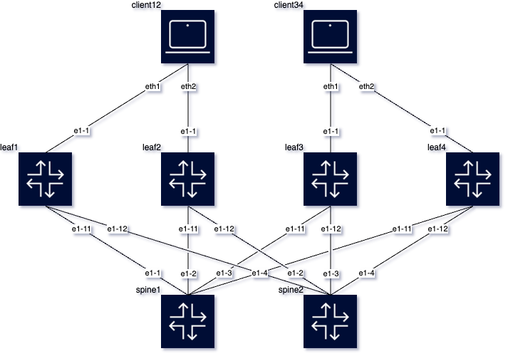

# 3 Stage Clos RFC7938 lab
This is a 3-stage Clos topology following RFC7938 bgp design for large scale DCs.
Config highlights:
- Underlay: dynamic unnumber ebgp peers, ipv4 family
- Overlay: multihop ebgp peers, evpn family. Inter-as-vpn command needed to that spines import evpn routes and reflect them to the leaves.
- MAC-VRF with multi-homing configured on all leaves.

